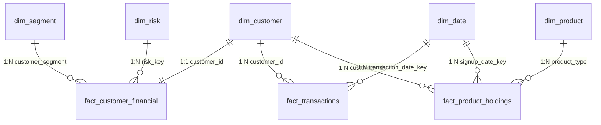

# Power BI Semantic Data Model & Grain Specification

This document details the semantic architecture, table grains, primary keys, foreign keys, cardinality, and refresh mechanisms for the **Financial / Consumer Behavior Analytics** Power BI data model.

---

## 1. Data Model Architecture Overview

The Power BI model is designed strictly as a **Star Schema** with:
- **5 Dimension Tables**: `dim_customer`, `dim_date`, `dim_product`, `dim_segment`, `dim_risk`
- **3 Fact Tables**: `fact_transactions`, `fact_customer_financial`, `fact_product_holdings`
- **Relationships**: 100% single-direction, 1-to-Many or 1-to-1 relationships. Zero many-to-many or circular relationships.



---

## 2. Table Grains & Key Specifications

### 1. `DIM_CUSTOMER`
- **Purpose**: Primary customer demographic profile.
- **Grain**: Exactly ONE row per customer.
- **Primary Key**: `customer_id`
- **Row Count**: 15,000 rows.
- **Source**: [`data/exports/powerbi/dim_customer.csv`](file:///C:/Users/ASUS/.gemini/antigravity/scratch/financial-consumer-behavior-analytics/data/exports/powerbi/dim_customer.csv)
- **Important Columns**: `customer_id`, `age`, `age_group`, `gender`, `education`, `employment_status`, `marital_status`, `city_tier`, `occupation`, `customer_since`, `customer_tenure_years`, `income_band`.

### 2. `DIM_DATE`
- **Purpose**: Continuous calendar date dimension for time intelligence.
- **Grain**: Exactly ONE row per calendar date (2018-01-01 to 2025-12-31).
- **Primary Key**: `date` (`YYYY-MM-DD`)
- **Row Count**: 2,922 rows.
- **Source**: [`data/exports/powerbi/dim_date.csv`](file:///C:/Users/ASUS/.gemini/antigravity/scratch/financial-consumer-behavior-analytics/data/exports/powerbi/dim_date.csv)
- **Important Columns**: `date`, `year`, `quarter`, `quarter_name`, `month_num`, `month_name`, `year_month`, `week_num`, `day_of_month`, `day_of_week`, `day_name`, `is_weekend`, `month_start_date`, `month_end_date`.

### 3. `DIM_PRODUCT`
- **Purpose**: Master product catalog and classification.
- **Grain**: Exactly ONE row per banking product type.
- **Primary Key**: `product_type_key` / `product_type`
- **Row Count**: 7 rows.
- **Source**: [`data/exports/powerbi/dim_product.csv`](file:///C:/Users/ASUS/.gemini/antigravity/scratch/financial-consumer-behavior-analytics/data/exports/powerbi/dim_product.csv)
- **Important Columns**: `product_type_key`, `product_type`, `product_category`, `description`.

### 4. `DIM_SEGMENT`
- **Purpose**: Business customer segmentation dimension.
- **Grain**: Exactly ONE row per business segment.
- **Primary Key**: `segment_key` / `customer_segment`
- **Row Count**: 7 rows.
- **Source**: [`data/exports/powerbi/dim_segment.csv`](file:///C:/Users/ASUS/.gemini/antigravity/scratch/financial-consumer-behavior-analytics/data/exports/powerbi/dim_segment.csv)
- **Important Columns**: `segment_key`, `customer_segment`, `segment_category`, `priority_level`, `description`.

### 5. `DIM_RISK`
- **Purpose**: Credit and debt risk matrix dimension.
- **Grain**: Exactly ONE row per risk tier combination.
- **Primary Key**: `risk_key`
- **Row Count**: 9 rows.
- **Source**: [`data/exports/powerbi/dim_risk.csv`](file:///C:/Users/ASUS/.gemini/antigravity/scratch/financial-consumer-behavior-analytics/data/exports/powerbi/dim_risk.csv)
- **Important Columns**: `risk_key`, `credit_risk_category`, `debt_risk_tier`, `risk_severity_rank`, `description`.

### 6. `FACT_TRANSACTIONS`
- **Purpose**: Individual transaction log fact table.
- **Grain**: Exactly ONE row per transaction.
- **Primary Key**: `transaction_id`
- **Foreign Keys**: `customer_id` -> `dim_customer.customer_id`, `transaction_date_key` -> `dim_date.date`
- **Row Count**: 75,744 rows.
- **Source**: [`data/exports/powerbi/fact_transactions.csv`](file:///C:/Users/ASUS/.gemini/antigravity/scratch/financial-consumer-behavior-analytics/data/exports/powerbi/fact_transactions.csv)
- **Important Columns**: `transaction_id`, `customer_id`, `transaction_date_key`, `transaction_datetime`, `transaction_type`, `category`, `amount`, `payment_method`, `merchant_type`.

### 7. `FACT_CUSTOMER_FINANCIAL`
- **Purpose**: Master customer financial health, savings, debt, credit, and RFM snapshot.
- **Grain**: Exactly ONE row per customer snapshot.
- **Primary Key**: `customer_id`
- **Foreign Keys**: `customer_id` -> `dim_customer.customer_id`, `segment_key` -> `dim_segment.segment_key`, `risk_key` -> `dim_risk.risk_key`
- **Row Count**: 15,000 rows.
- **Source**: [`data/exports/powerbi/fact_customer_financial.csv`](file:///C:/Users/ASUS/.gemini/antigravity/scratch/financial-consumer-behavior-analytics/data/exports/powerbi/fact_customer_financial.csv)
- **Important Columns**: `monthly_income`, `annual_income`, `total_monthly_expense`, `disposable_income`, `savings_balance`, `savings_rate`, `emergency_fund_status`, `total_debt`, `debt_to_income_ratio`, `credit_score`, `missed_payments`, `credit_utilization`, `total_transactions`, `total_transaction_amount`, `rfm_score_code`, `rfm_segment`, `financial_health_score`.

### 8. `FACT_PRODUCT_HOLDINGS`
- **Purpose**: Individual customer banking product relationship holdings.
- **Grain**: Exactly ONE row per customer product holding.
- **Primary Key**: `product_id`
- **Foreign Keys**: `customer_id` -> `dim_customer.customer_id`, `product_type_key` -> `dim_product.product_type_key`, `signup_date_key` -> `dim_date.date`
- **Row Count**: 31,274 rows.
- **Source**: [`data/exports/powerbi/fact_product_holdings.csv`](file:///C:/Users/ASUS/.gemini/antigravity/scratch/financial-consumer-behavior-analytics/data/exports/powerbi/fact_product_holdings.csv)
- **Important Columns**: `product_id`, `customer_id`, `product_type_key`, `product_type`, `product_status`, `signup_date_key`, `is_active`.

---

## 3. Data Refresh & Orchestration

The Power BI datasets are regenerated automatically by running:
```bash
python run_pipeline.py --powerbi
```
This triggers SQLite DDL execution, analytical view materialization, dataset formatting, and quality assertion validation.
